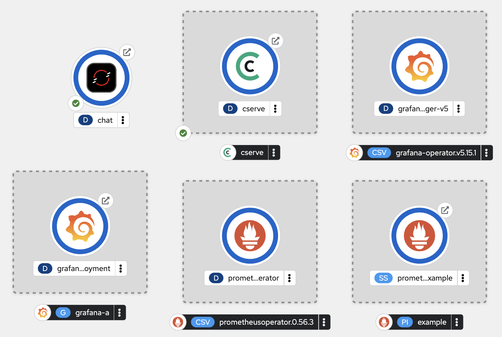
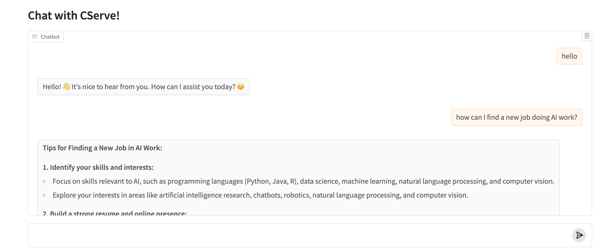
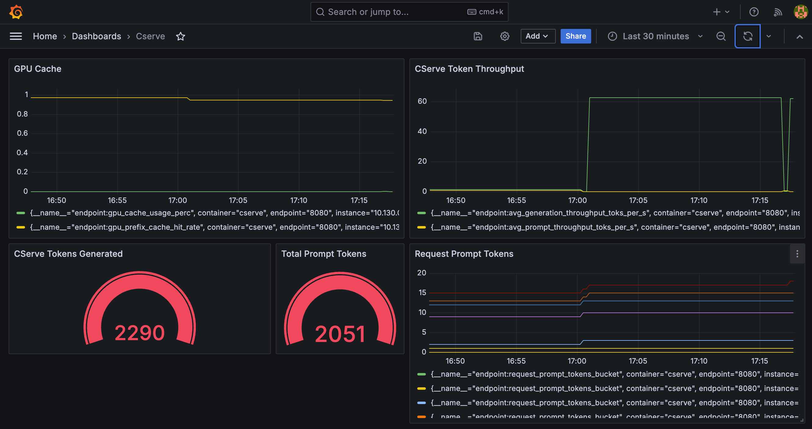

# Deploy cserve on Openshift

## This README is a work in progress.

## Approaches

### 1a. Push the cserve container to your Openshift registry

Use `podman` to pull and push the cserve container.

Configure the helm chart `values.yaml` file:
```yaml
image:
  repository: default-route-openshift-image-registry.apps.cluster-8q5hz.8q5hz.sandbox840.opentlc.com/centml/cserve
  tag: 2.0.0.dev0-ocp
  pullPolicy: IfNotPresent
  imagePullSecrets:
    - name: default-dockercfg-tsfm6
```

### 1b. Configure Openshift to pull from CentML's registry


#### Generate a pull token
```bash
gcloud auth login
gcloud auth configure-docker us-central1-docker.pkg.dev
gcloud auth print-access-token
```

#### Create an Openshift pull secret using the token from above
```bash
oc create secret generic centmldockerpull --from-file=.dockerconfigjson=./dockerconfig.json --type=kubernetes.io/dockerconfigjson
```

Configure the helm chart `values.yaml` file:
```yaml
image:
repository: us-central1-docker.pkg.dev/cserve-dev/cserve-docker/cserve
  tag: 2.0.0.dev0-ocp
  pullPolicy: IfNotPresent
  imagePullSecrets:
    - name: centmldockerpull
```

#### Run the cserve helm chart
```bash
helm install -f cserve/values.yaml --namespace=centml cserve ./cserve
```

#### Open a web terminal from the Openshift Web UI and test using `curl`.

```bash
export CSERVE_HOST=http://cserve.centml:8080
curl cserve.centml:8080/
```

```
{"status":"RUNNING","model":"google/gemma-2b-it","api_type":"chat"}
```
```bash
curl -H 'Content-Type: application/json' $CSERVE_HOST/openai/v1/models | jq

curl -N -X POST  -H 'Content-Type: application/json' $CSERVE_HOST/cserve/v1/generate -d '{"prompt": "What is a large language model? ", "sampling_params": {"n": 1, "temperature": 0, "max_tokens": 1024}, "stream": true}'
```

#### Deploy the example chat client on Openshift

```bash
oc new-app --name=chat https://github.com/bkoz/cserve.git
```

Create a route to visit the chat with a web browser.
```bash
oc create route edge chat --service=chat --insecure-policy='Redirect'
```


Openshift Topology


Example Chat application

#### Monitoring

##### Deploy Prometheus

##### Deploy Grafana

Add a Grafana dashboard



